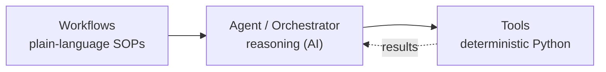
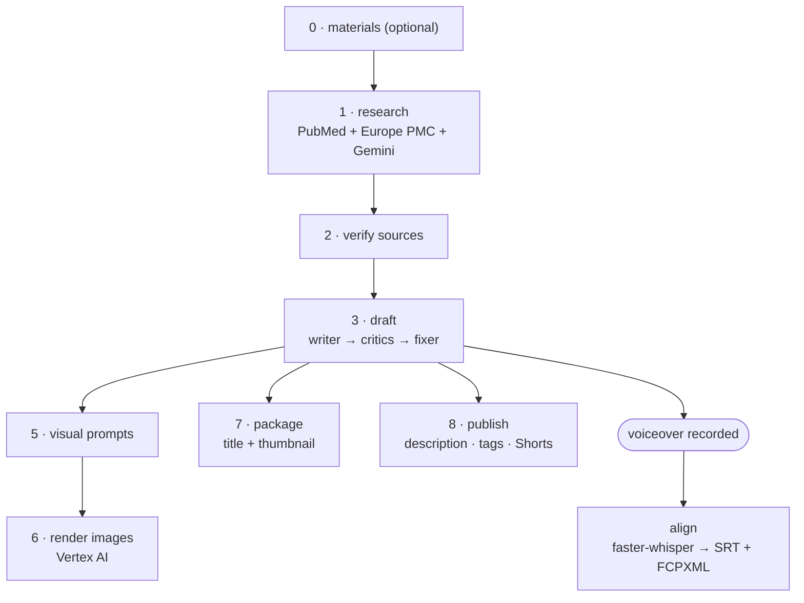
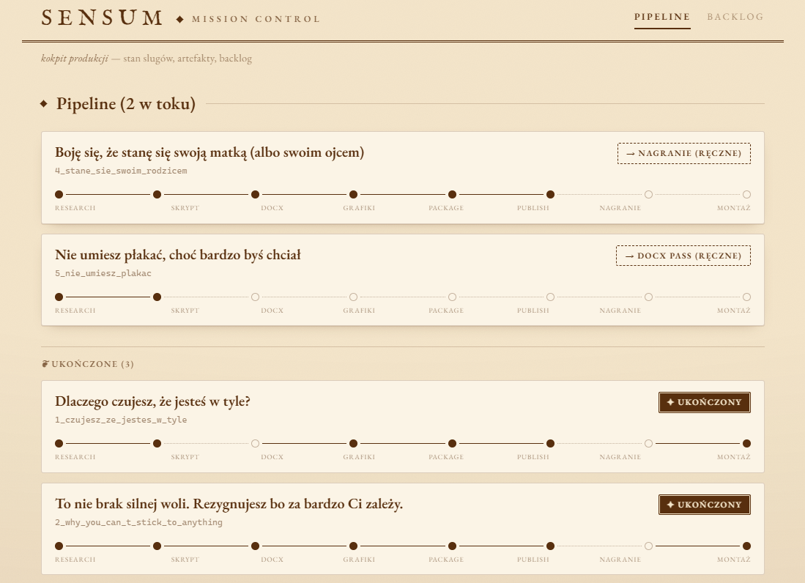

# SENSUM — AI Content-Automation Pipeline

> An end-to-end pipeline that turns a topic into a publish-ready video package —
> **research → script → visuals → packaging → publishing** — built by orchestrating
> an AI coding agent under a structured framework.

**Stack:** Python · FastAPI · Google Vertex AI (Gemini) · faster-whisper ·
PubMed / Europe PMC APIs · Claude Code (agent orchestration)

---

## What it does

SENSUM removes the manual glue work between content-production stages. From a single
topic it runs:

1. **Research** — pulls peer-reviewed sources (PubMed + Europe PMC), then verifies them.
2. **Script** — writes and self-reviews narration via a chain of cold-context AI
   subagents (writer → critics → fixer).
3. **Visuals** — generates image prompts and renders illustrations (Vertex AI) in a
   strict two-colour brand style.
4. **Packaging** — proposes titles and thumbnails.
5. **Publishing** — produces the title, description, chapters, tags, and Shorts copy.
6. **Edit bundle** — after the voiceover is recorded, force-aligns audio to the script
   (faster-whisper) and exports an SRT + a DaVinci Resolve timeline (FCPXML).

~37 Python modules across 8 agent stages, with a unit-test suite and a read-only
FastAPI control dashboard.

---

## Architecture

The system rests on a **WAT** separation — *Workflows, Agents, Tools* — so that
probabilistic reasoning and deterministic execution never blur:



The reasoning layer reads plain-language SOPs and decides *what* to do; the
deterministic layer does the mechanical work — API calls, image processing, forced
alignment, document generation, validation.

### Pipeline



---

## How it was built — agentic engineering

This project is an experiment in **building software by directing an AI coding agent**
(Claude Code) rather than hand-writing it. My contribution is the **system design**:
the architecture, the decomposition into single-responsibility agents, the workflow
SOPs, the review/iteration loops, and the quality doctrine. The implementation was
generated by the agent under that direction — reviewed, tested, and iterated against
real output across 100+ commits.

It is a deliberate methodology, not a shortcut: the pipeline design and most of the
governing specification (the project's `CLAUDE.md`) are mine; the agent translated that
design into working, test-covered code.

---

## Tech stack

| Area | Tools |
| --- | --- |
| Language / runtime | Python 3 |
| AI / LLM | Google Vertex AI (Gemini), Claude Code (orchestration) |
| Research APIs | PubMed (NCBI E-utilities), Europe PMC |
| Audio / ASR | faster-whisper (forced alignment) |
| Web / API | FastAPI + Uvicorn (control dashboard) |
| Media / docs | Pillow, python-docx, pdfplumber |
| Testing | unittest |

---

## Repository structure

```
.claude/            Claude Code interface — slash commands, skills, subagent definitions
workflows/          Plain-language SOPs (the "what") — one per pipeline stage
tools/              Deterministic Python (the "how")
  pipeline/         Numbered agent scripts 0–8 + forced alignment
  mission_control/  Read-only FastAPI dashboard
tests/              Unit tests
docs/               References + research outputs
```

<!-- Screenshots: add images to docs/screenshots/ and uncomment.
## Screenshots


-->

---

## Notes

- The channel produces **Polish-language** content (`@sensumpolska`). The research
  layer runs in English (PubMed / Europe PMC); the script layer outputs Polish — by design.
- Brand assets, recorded audio, and rendered output are kept out of the repository.
- Secrets live only in a local `.env`, never committed.

## What I'd build next

- A persistence layer (PostgreSQL) for pipeline state, replacing the filesystem.
- Containerization + CI (GitHub Actions running the test suite on every push).
- A deployed version of the control dashboard.
